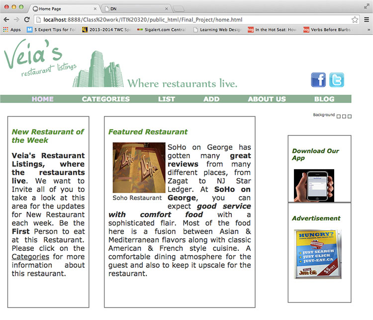
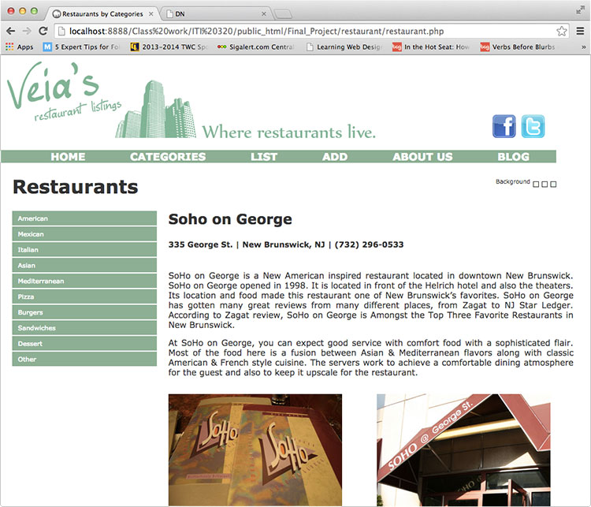
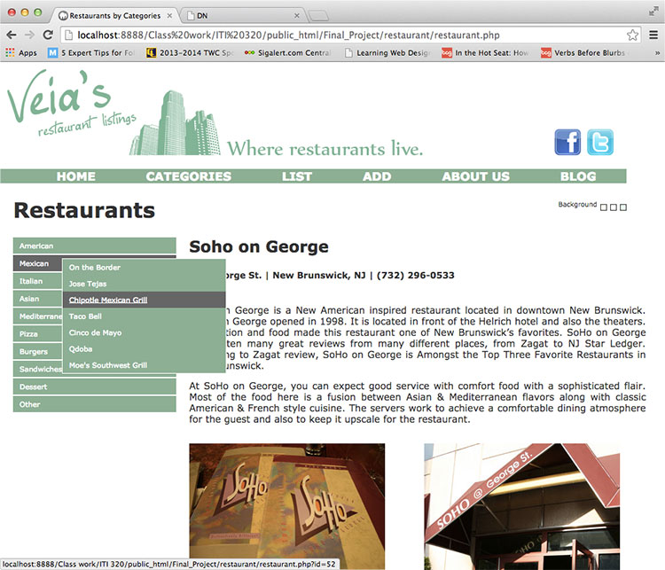
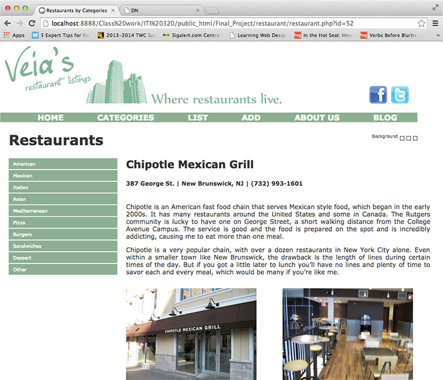
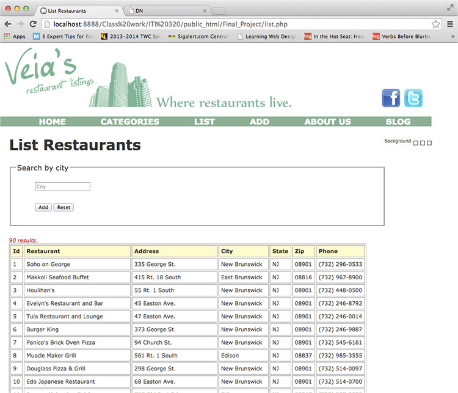
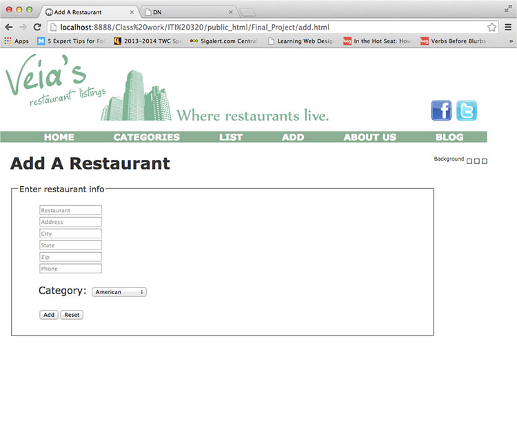

  
`School Work - Web Design Class - ITI-320`  

# Dates:  
2012 - 2013  
# Technologies:  
Photoshop, Dreamweaver, HTML5, CSS3, PHP, MySQL
# Description:  
This final project is a fictitious restaurant locating website based on [Yelp - http://www.yelp.com](http://www.yelp.com/).  Among its features is the ability to choose a restaurant sorted by categories and to search by city.  It also gives the user the ability to add new restaurants to the database.  

This final project involved 3 members total.  
I was in charge of the majority of the coding and some design.  Another was in charge of mostly design and some coding.  The last member was in charge with research and gathering data.  The restaurant data is stored in a MySQL database and uses PHP to retrieve and present data to the webpage.  
# Screenshots:
  

  

  

  

  

  
